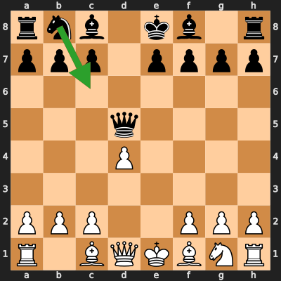
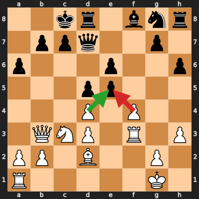
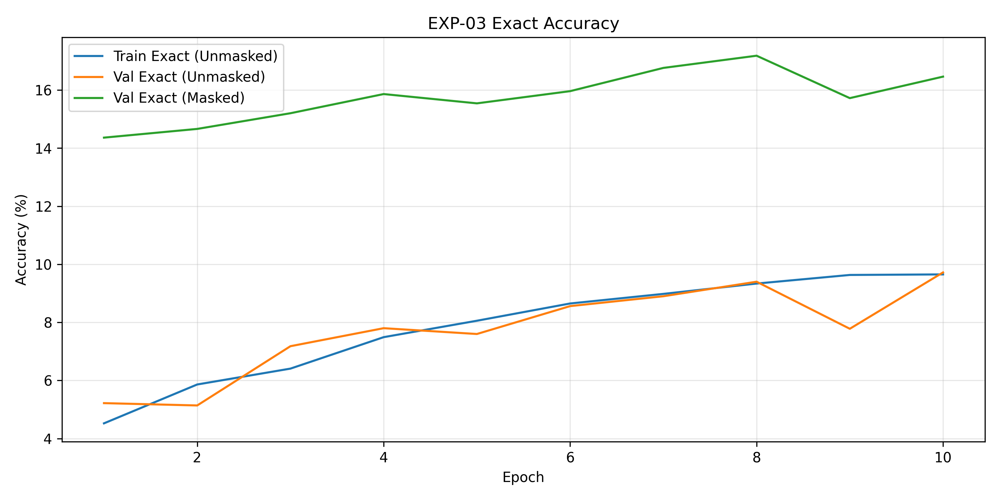
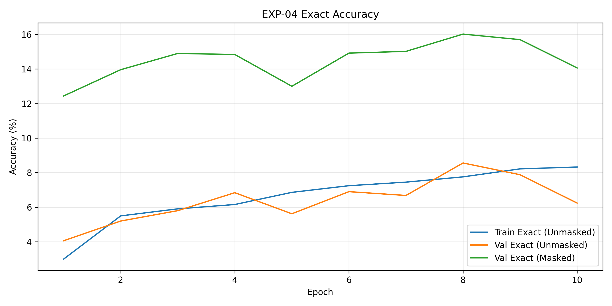
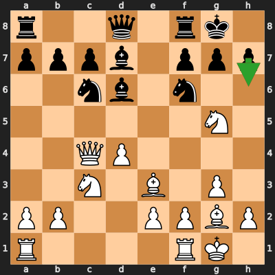
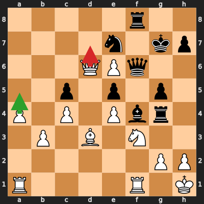

# BrahimClone

**A Transformer that plays chess like me — not like Stockfish.**

BrahimClone is a behavioral-cloning project: scrape my Chess.com / Lichess games, train a neural net exclusively on *my* 10-minute rapid moves, and measure how well it reproduces my style. The goal is stylistic fidelity, not engine strength.

<p align="center">
  
  
</p>
<p align="center"><em>Green arrow = what I played · Red arrow = what the clone chose</em></p>

---

## Highlights

- End-to-end pipeline: scrape → normalize by time control → FEN datasets → train → evaluate → play
- Controlled one-variable-at-a-time experiment ladder
- Production model: **6-layer Transformer** with **2D board positional encodings**
- Peak result: **42.7% Top-1 / 72.7% Top-5** masked exact accuracy (EXP-12)
- Interactive Streamlit apps to play the clone and inspect its Top-5 candidate moves

## How we measure success

Chess has ~30 legal moves in a typical position. Predicting my *exact* next move is a hard multi-class problem — even a strong stylistic clone will often pick a plausible alternative.

Three metrics are used throughout:

| Metric | What it means |
|---|---|
| **Unmasked exact** | Argmax over all 64×64 start/end pairs equals the human move (includes illegal junk) |
| **Masked Top-1** | Same, but illegal moves are zeroed with `python-chess` first — the fair “did it pick my move?” score |
| **Masked Top-5** | Is my move inside the model’s five highest-probability *legal* moves? |

**Why Top-5 matters:** Top-1 alone understates style. Humans often have 2–3 “natural” moves in a position. If the clone ranks my move #2 or #3, it still “thinks like me.” Top-5 is the stylistic-intent metric; Top-1 is the strict identity metric.

---

## Results at a glance

| Exp | Idea | Dataset | Masked Top-1 | Masked Top-5 |
|---|---|---|---|---|
| 01 | Baseline Transformer | All 10-min | 8.68% *(unmasked)* | — |
| 03 | Elo filter + legal masking | Elo ≥ 1100 | **18.50%** | — |
| 04 | Coupled start→end heads | Elo ≥ 1100 | 17.92% | — |
| 07 | Unified 4096-way action head | Elo ≥ 1100 | ~2% *(failed)* | — |
| 08 | History prefix on raw FEN | Elo ≥ 1100 + history | ~0–2% *(failed)* | — |
| **12** | **Unpacked FEN + 2D PE** | Elo ≥ 1100 | **42.66%** | **72.66%** |
| 13 | Spatial ResNet CNN | Elo ≥ 1100 | ~18% unmasked val *(overfit)* | — |
| 14 | 2D + history, train from scratch | Elo ≥ 1400 | 33.36% | 59.88% |
| 15 | Fine-tune EXP-12 on Elo ≥ 1400 | Elo ≥ 1400 | 31.04% | **63.22%** |

> EXP-12 / 14 / 15 numbers were re-measured with `experiments/eval_topk.py` on the held-out test splits. EXP-01/03/04 numbers are from the original lab notes. EXP-07/08/13 figures are read from the committed training curves under `plots/`.

---

## Experiment log

Every experiment changes **one** major idea so the deltas are interpretable.

### EXP-01 — Baseline (“can a Transformer read FEN at all?”)

**Philosophy.** Before clever tricks, establish a floor. Feed raw FEN strings into a 6-layer Transformer (`d_model=512`, 8 heads) with two independent heads: one predicts the origin square (1 of 64), one predicts the destination (1 of 64). Train on *all* of my 10-minute games, no Elo filter, no legality check.

**Result.** Exact move accuracy **8.68%**. The network learns basic board geometry from character-level FEN, but low-rated blunders in the early data inject heavy label noise.

---

### EXP-03 — Quality filter + forced legality

**Philosophy.** Two hypotheses stacked carefully:
1. Drop games where my Elo was below 1100 — remove the noisiest stretch of my history.
2. At evaluation, multiply the joint start×end probability matrix by a legal-move mask. If the model’s mass is spilling onto impossible squares, masking reveals whether its *intent* was correct.

**Result.**
- Raw (unmasked) exact: **9.76%** (+1.08 from data cleaning alone)
- Masked exact: **18.50%** (+9.82 from masking)

**Insight.** The Transformer already “understood” more than Top-1 suggested — most of the gap was illegal probability mass, not wrong ideas. Masking became a permanent evaluation standard after this.

<p align="center">
  
</p>

---

### EXP-04 — Coupled heads

**Philosophy.** Independent start/end heads can predict an incoherent pair (e.g. start=`e2`, end=`a8`). Condition the end-head on a soft embedding of the start prediction so the two heads are structurally linked.

**Result.**
- Raw exact: **9.86%** (best raw so far)
- Masked exact: **17.92%** (slightly below EXP-03)

**Insight.** Coupling helps native coordinate pairing, but errors in the start head now *force* the end head off-track — a classic error-propagation tradeoff. Masked accuracy dipped slightly; kept the idea for later architectures in a softer form.

<p align="center">
  
</p>

---

### EXP-10 — Top-5 tactical intent (+ the vocab bug)

**Philosophy.** Exact Top-1 is too harsh for style cloning. Rank the five most probable *legal* moves and ask: is the human move in that shortlist? A high Top-5 with a middling Top-1 means the model shares my candidate set even when it doesn’t pick the same favorite.

**What happened.** The first Top-5 eval of a saved checkpoint scored **0.12%** in a fresh terminal. Root cause: the vocab was built from `set(FEN_CHARS)`, and Python randomizes `set()` iteration order per process — so embedding row `i` meant different characters at train vs. infer time. Fix: always `sorted(set(...))`. After the fix, Top-5 evaluation became trustworthy and is now the primary “does it think like me?” metric.

Inspect live with:

```bash
streamlit run apps/inspect_top5.py
```

---

### EXP-07 — Unified 4096-way action space

**Philosophy.** Stop predicting start and end separately. Treat every `(from, to)` pair as one of 4096 discrete actions — one softmax, no pairing errors.

**Result.** Collapsed. Unmasked exact accuracy stayed around **1–2.5%** across training (`plots/exp07_exact_accuracy.png`). The 4096-way head was too sparse for the dataset size; gradients couldn’t focus.

**Insight.** Negative result, but informative: with this data volume, factorized (start × end) heads beat a flat move classifier.

---

### EXP-08 — Historical context on raw FEN

**Philosophy.** A static FEN has no momentum. If my opponent just hung a piece, the model shouldn’t have to rediscover that from the board alone. Prepend the opponent’s last UCI move to the token sequence.

**Result.** Training was unstable — validation exact bounced between ~0% and ~1.5% (`plots/exp08_exact_accuracy.png`). Bolting history onto a raw character FEN (without a board-aligned representation) didn’t help.

**Insight.** History is valuable, but only after the board encoding itself is spatial. Revisited successfully in EXP-14/15 once 2D encodings existed.

---

### EXP-12 — Unpacked FEN + 2D positional encodings ⭐

**Philosophy.** Raw FEN is a compressed string (`8/5k2/...`) — the Transformer must invent board geometry from slash-separated ranks. Instead:

1. **Unpack** the board into 64 fixed characters (`a1`→`h8`), so token index = chess square index
2. Replace sinusoidal PE with **2D positional encodings** — learned file + rank embeddings concatenated per square
3. Predict start/end with **per-square linear heads** over the 64 board tokens; soft-pool the start distribution as context for the end head

**Result (Elo ≥ 1100 test set, masked):**
- **Top-1: 42.66%**
- **Top-5: 72.66%**

This is the breakthrough. More than 7 in 10 positions, my actual move is among the clone’s top five legal suggestions. The architecture finally speaks the language of a chessboard.

---

### EXP-13 — Spatial CNN baseline

**Philosophy.** If the win in EXP-12 came from spatial structure, a ResNet over a classic 14×8×8 board tensor (12 piece planes + 2 last-move planes) should also work — and is the standard representation in chess ML.

**Result.** Validation unmasked exact plateaued around **18%** while training climbed past **50%** — clear overfitting (`plots/exp13_exact_accuracy.png`). The CNN memorized the training set but generalized no better than the early Transformer + mask baseline.

**Insight.** Inductive bias alone isn’t enough; the 2D Transformer’s capacity + unpacked tokens generalized better on this dataset.

---

### EXP-14 — Peak-self data (Elo ≥ 1400) + real history

**Philosophy.** Clone *peak* Brahim, not average Brahim. Retrain the EXP-12 architecture from scratch on games where my Elo was ≥ 1400, and this time actually feed `Opponent_Last_Move_UCI` into the unpacked sequence.

**Result (Elo ≥ 1400 test set, masked):**
- **Top-1: 33.36%**
- **Top-5: 59.88%**

Absolute numbers are lower than EXP-12 because the Elo ≥ 1400 test distribution is harder / smaller — but the model is now specialized to my stronger play.

---

### EXP-15 — Fine-tune EXP-12 → Elo ≥ 1400

**Philosophy.** Don’t throw away the EXP-12 representation. Load those weights and fine-tune on the peak-self (Elo ≥ 1400) splits — transfer the board geometry prior, adapt the style.

**Result (Elo ≥ 1400 test set, masked):**
- **Top-1: 31.04%**
- **Top-5: 63.22%**

Slightly lower Top-1 than EXP-14, but the **best Top-5 on the peak-self set**. This is the default checkpoint for the play app: when it doesn’t pick my exact move, it’s still very often in my candidate set.

<p align="center">
  
  
</p>

---

## What the ladder taught me

1. **Mask illegal moves at eval** — otherwise you underestimate the model by ~2×.
2. **Clean the data** (Elo floor) before changing architecture.
3. **Top-5 is the style metric**; Top-1 is the identity metric. Aim for both.
4. **Board-aligned inputs beat string FEN** — unpacking + 2D PE was the real leap (18% → 43% Top-1).
5. **Failed ideas are data** — unified 4096 head and naïve history prefixes both flopped, and that steered EXP-12.
6. **Deterministic tokenization is non-negotiable** — one `set()` bug silently destroyed inference.

---

## Production architecture (EXP-12 / 14 / 15)

1. Unpack FEN → 64 board chars + metadata + padded last-move slot  
2. Deterministic character vocab  
3. 2D file/rank positional encodings on board tokens  
4. 6-layer Transformer encoder (`d_model=512`, 8 heads)  
5. Per-square start head → soft start context → per-square end head  
6. At inference, score only legal moves (queen promotions preferred)

---

## Project layout

```
brahim-chess/
├── brahim_chess/          # Shared library (models, data, metrics, inference)
├── apps/                  # Streamlit demos
│   ├── play.py            # Play against the clone
│   └── inspect_top5.py    # Top-5 move inspector
├── experiments/
│   ├── train_2d.py        # Production trainer (EXP-12 / 14 / 15)
│   ├── eval_topk.py       # Masked Top-1 / Top-5 eval
│   └── legacy/            # Original self-contained experiment scripts
├── scripts/data/          # Scrape → normalize → CSV → split
├── data/                  # PGNs + CSV splits
├── models/                # Checkpoints (gitignored — train locally)
├── plots/                 # Training curves + qualitative SVGs
└── docs/                  # Experiment notes
```

## Quickstart

```bash
python -m venv .venv
# Windows: .venv\Scripts\activate
# macOS / Linux: source .venv/bin/activate
pip install -r requirements.txt

# Optional: rebuild datasets from your own games
python scripts/data/scrape_chesscom.py --username YOUR_USER
python scripts/data/scrape_lichess.py --username YOUR_USER
python scripts/data/normalize_games.py
python scripts/data/generate_dataset.py --min-elo 1400
python scripts/data/split_dataset.py

# Train (pass --no-init to start from scratch)
python experiments/train_2d.py --exp-name exp15_finetuned

# Evaluate Top-1 / Top-5
python experiments/eval_topk.py

# Play / inspect
streamlit run apps/play.py
streamlit run apps/inspect_top5.py
```

> Model weights (`.pth`) are **not** in git (~70MB each, >1GB total). Train locally or request a Release artifact.

## Roadmap

- [ ] Publish best checkpoint via GitHub Releases
- [ ] Lichess Bot API live deployment
- [ ] Wins-only dataset ablation (EXP-05)
- [ ] Multi-move history / clock features

## License

MIT — see [LICENSE](LICENSE).
